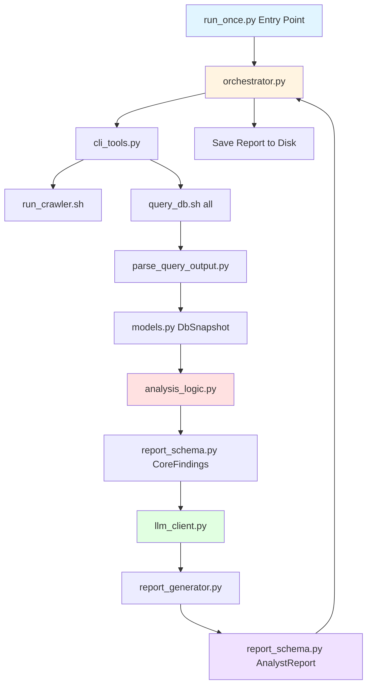

# Analyst Agent Pseudocode Analysis

## Overview

The **analyst_agent** is a skeleton implementation for a news-based financial analyst agent built on top of the `news_regime` system. It's designed to:

1. **Collect data** from the news_regime database via CLI tools
2. **Analyze** the data using rule-based logic
3. **Generate reports** using an LLM (OpenAI Agents SDK)
4. **Deliver insights** about market regime, volatility, and trading recommendations

**Current Status**: This is a **design skeleton with pseudocode**. All functions raise `NotImplementedError` with detailed TODO comments explaining what needs to be implemented.

---

## Architecture Overview



---

## Module Breakdown

### 1. **[models.py](file:///home/ubuntu/analyst_agent/models.py)** - Core Data Models

Defines data structures that mirror the output from [query_db.sh](file:///home/ubuntu/news_regime/query_db.sh):

#### Enums
- **[RecommendationStatus](file:///home/ubuntu/analyst_agent/models.py#9-16)**: ACTIVE, INACTIVE, HOLD, UNKNOWN
- **[RegimeLabel](file:///home/ubuntu/analyst_agent/models.py#18-25)**: risk_on, risk_off, sideways, unknown

#### Data Classes
- **[NewsArticle](file:///home/ubuntu/analyst_agent/models.py#27-39)**: Single news article with title, publisher, category, crawled time, URL, summary
- **[ArticleStats](file:///home/ubuntu/analyst_agent/models.py#41-51)**: Aggregated statistics (total articles, avg sentiment/impact, risk flag counts)
- **[SymbolStats](file:///home/ubuntu/analyst_agent/models.py#53-60)**: Per-symbol statistics (symbol, article count, avg score)
- **[Recommendation](file:///home/ubuntu/analyst_agent/models.py#62-74)**: Trading recommendation with sentiment, impact, composite scores, risk ratios
- **[RegimeRecord](file:///home/ubuntu/analyst_agent/models.py#76-84)**: Market regime classification with timestamp, label, confidence, description
- **[DbSnapshot](file:///home/ubuntu/analyst_agent/models.py#86-97)**: Complete snapshot containing all above data at a given time

**Purpose**: Provides type-safe structures for all data flowing through the system.

---

### 2. **[config.py](file:///home/ubuntu/analyst_agent/config.py)** - Configuration Management

#### Configuration Classes

**[VolatilityThresholdConfig](file:///home/ubuntu/analyst_agent/config.py#7-21)**
- Defines thresholds for classifying volatility levels
- `impact_normal_max`: 0.1
- `impact_caution_min`: 0.15
- `impact_spike_min`: 0.3
- `risk_flag_caution_ratio`: 0.1
- `risk_flag_spike_ratio`: 0.3

**[LlmConfig](file:///home/ubuntu/analyst_agent/config.py#23-32)**
- Model: "gpt-5.1-mini" (note: this should likely be "gpt-4o-mini")
- Temperature: 0.3
- Max tokens: 2048
- Request timeout: 30.0s
- Response format: "text"

**[AnalystAgentConfig](file:///home/ubuntu/analyst_agent/config.py#34-48)** (Top-level)
- `hours_window`: 24 (time window for analysis)
- `news_limit`: 50 (max news articles to process)
- `run_crawler_before_analysis`: True
- `report_output_dir`: "./reports"
- `log_dir`: "./logs"
- `regime_window_size`: 3 (for regime change detection)
- Includes nested [VolatilityThresholdConfig](file:///home/ubuntu/analyst_agent/config.py#7-21) and [LlmConfig](file:///home/ubuntu/analyst_agent/config.py#23-32)

**[load_analyst_agent_config()](file:///home/ubuntu/analyst_agent/config.py#50-64)**
- **TODO**: Load from environment variables or config files
- Currently returns default config

---

### 3. **[cli_tools.py](file:///home/ubuntu/analyst_agent/cli_tools.py)** - Shell Command Wrappers

Provides Python wrappers for executing shell scripts:

**[CliCommandResult](file:///home/ubuntu/analyst_agent/cli_tools.py#8-19)** dataclass
- Captures: command, stdout, stderr, exit_code, timestamps, success flag

**[run_crawler_command(timeout_seconds)](file:///home/ubuntu/analyst_agent/cli_tools.py#21-30)**
- **TODO**: Execute [./run_crawler.sh](file:///home/ubuntu/news_regime/run_crawler.sh)
- Use `subprocess.run` with timeout
- Return [CliCommandResult](file:///home/ubuntu/analyst_agent/cli_tools.py#8-19)

**[run_query_db_all(hours, limit, timeout_seconds)](file:///home/ubuntu/analyst_agent/cli_tools.py#32-45)**
- **TODO**: Execute `./query_db.sh all --hours H --limit N`
- Capture output for parsing
- Return [CliCommandResult](file:///home/ubuntu/analyst_agent/cli_tools.py#8-19)

**Purpose**: Bridge between Python code and existing bash scripts.

---

### 4. **[parse_query_output.py](file:///home/ubuntu/analyst_agent/parse_query_output.py)** - Text Parsing

Parses the textual output from `query_db.sh all` into structured data:

**[split_query_all_output(raw_output)](file:///home/ubuntu/analyst_agent/parse_query_output.py#15-23)**
- **TODO**: Split output into sections (News, Analysis, Symbols, Recommendations, Regime)
- Detect section headers (e.g., "News Articles", "Article Analysis")
- Return dict mapping section names to text

**Section Parsers** (all TODO):
- [parse_news_section()](file:///home/ubuntu/analyst_agent/parse_query_output.py#25-28) → `List[NewsArticle]`
- [parse_article_analysis_section()](file:///home/ubuntu/analyst_agent/parse_query_output.py#30-33) → [ArticleStats](file:///home/ubuntu/analyst_agent/models.py#41-51)
- [parse_symbol_mappings_section()](file:///home/ubuntu/analyst_agent/parse_query_output.py#35-38) → `List[SymbolStats]`
- [parse_recommendations_section()](file:///home/ubuntu/analyst_agent/parse_query_output.py#40-43) → `List[Recommendation]`
- [parse_regime_history_section()](file:///home/ubuntu/analyst_agent/parse_query_output.py#45-48) → `List[RegimeRecord]`

**[build_db_snapshot(raw_output, hours_window)](file:///home/ubuntu/analyst_agent/parse_query_output.py#50-59)**
- **TODO**: Orchestrate all parsers to build complete [DbSnapshot](file:///home/ubuntu/analyst_agent/models.py#86-97)

**Implementation Notes**:
- Need to parse formatted text output (separators, indentation, etc.)
- Handle datetime parsing (ISO format strings)
- Parse JSON-like structures (e.g., risk_summary dicts)
- Robust error handling for malformed output

---

### 5. **[analysis_logic.py](file:///home/ubuntu/analyst_agent/analysis_logic.py)** - Rule-Based Analysis

Core analytical functions that process the [DbSnapshot](file:///home/ubuntu/analyst_agent/models.py#86-97):

**[analyze_regime_change(regime_history, window_size)](file:///home/ubuntu/analyst_agent/analysis_logic.py#16-22)**
- **TODO**: Detect if regime changed recently
- Compare last N regime records
- Return [RegimeChange](file:///home/ubuntu/analyst_agent/report_schema.py#21-29) with previous/current regime and direction

**[assess_volatility(article_stats, regime_history, config)](file:///home/ubuntu/analyst_agent/analysis_logic.py#24-31)**
- **TODO**: Classify volatility level (NORMAL, WATCH, CAUTION, SPIKE)
- Use thresholds from config
- Consider avg impact, risk flag ratios
- Return [VolatilityAssessment](file:///home/ubuntu/analyst_agent/report_schema.py#31-38) with level, reason, key drivers

**[select_top_recommendations(recommendations, max_count)](file:///home/ubuntu/analyst_agent/analysis_logic.py#33-39)**
- **TODO**: Sort by composite score
- Return top N recommendations

**[identify_focus_symbols(symbol_stats, recommendations, max_count)](file:///home/ubuntu/analyst_agent/analysis_logic.py#41-48)**
- **TODO**: Find symbols with concentrated news/sentiment
- Cross-reference with recommendations
- Return `List[FocusSymbol]`

**[extract_key_news_drivers(news, article_stats, regime_history, max_count)](file:///home/ubuntu/analyst_agent/analysis_logic.py#50-58)**
- **TODO**: Identify most impactful news articles
- Consider sentiment, impact scores, regime context
- Return `List[KeyNewsDriver]`

**[build_core_findings(snapshot, config)](file:///home/ubuntu/analyst_agent/analysis_logic.py#60-66)**
- **TODO**: Orchestrate all above functions
- Build complete [AnalystCoreFindings](file:///home/ubuntu/analyst_agent/report_schema.py#62-74) object

**Purpose**: Transform raw data into actionable insights using domain logic.

---

### 6. **[report_schema.py](file:///home/ubuntu/analyst_agent/report_schema.py)** - Report Data Structures

Defines higher-level structures for the final report:

#### Enums
- **[VolatilityLevel](file:///home/ubuntu/analyst_agent/report_schema.py#12-19)**: NORMAL, WATCH, CAUTION, SPIKE

#### Analysis Structures
- **[RegimeChange](file:///home/ubuntu/analyst_agent/report_schema.py#21-29)**: has_changed, previous, current, change_direction
- **[VolatilityAssessment](file:///home/ubuntu/analyst_agent/report_schema.py#31-38)**: level, reason, key_drivers
- **[FocusSymbol](file:///home/ubuntu/analyst_agent/report_schema.py#40-49)**: symbol, article_count, avg_sentiment, is_recommended, notes
- **[KeyNewsDriver](file:///home/ubuntu/analyst_agent/report_schema.py#51-60)**: title, summary, impact_direction, impact_scope, reason

#### Core Findings
- **[AnalystCoreFindings](file:///home/ubuntu/analyst_agent/report_schema.py#62-74)**: Aggregates all analysis results
  - current_regime
  - regime_change
  - volatility
  - top_recommendations
  - focus_symbols
  - key_news_drivers
  - article_stats
  - raw_snapshot

#### Final Report
- **[AnalystReport](file:///home/ubuntu/analyst_agent/report_schema.py#76-86)**: Complete report object
  - generated_at
  - config
  - core_findings
  - formatted_text (LLM-generated)
  - summary_header
  - metadata

---

### 7. **[llm_client.py](file:///home/ubuntu/analyst_agent/llm_client.py)** - LLM Integration

**[LlmClient](file:///home/ubuntu/analyst_agent/llm_client.py#10-29)** class
- Wraps OpenAI Agents SDK
- Configuration via [LlmConfig](file:///home/ubuntu/analyst_agent/config.py#23-32)

**[generate_report_text(core_findings, extra_context)](file:///home/ubuntu/analyst_agent/llm_client.py#16-29)**
- **TODO**: 
  - Convert [AnalystCoreFindings](file:///home/ubuntu/analyst_agent/report_schema.py#62-74) to JSON/dict
  - Build structured prompt with sections
  - Call Agents SDK
  - Return formatted text report

**Implementation Notes**:
- Need to integrate OpenAI Agents SDK (not standard OpenAI API)
- Prompt should request specific sections (Executive Summary, Market Regime, Volatility, Recommendations, etc.)
- Consider using structured output or JSON mode for consistency

---

### 8. **[report_generator.py](file:///home/ubuntu/analyst_agent/report_generator.py)** - Report Assembly

**[generate_analyst_report(core_findings, config, llm_client)](file:///home/ubuntu/analyst_agent/report_generator.py#10-17)**
- **TODO**:
  - Call `llm_client.generate_report_text()`
  - Assemble [AnalystReport](file:///home/ubuntu/analyst_agent/report_schema.py#76-86) object
  - Add metadata (generation time, config snapshot)
  - Return complete report

**Purpose**: Bridge between analysis logic and LLM output.

---

### 9. **[orchestrator.py](file:///home/ubuntu/analyst_agent/orchestrator.py)** - Main Workflow

Coordinates the entire analysis cycle:

**[run_analyst_cycle_once(config)](file:///home/ubuntu/analyst_agent/orchestrator.py#15-18)**
- **TODO**:
  1. Optionally run crawler ([run_crawler_command()](file:///home/ubuntu/analyst_agent/cli_tools.py#21-30))
  2. Query database ([run_query_db_all()](file:///home/ubuntu/analyst_agent/cli_tools.py#32-45))
  3. Parse output ([build_db_snapshot()](file:///home/ubuntu/analyst_agent/parse_query_output.py#50-59))
  4. Analyze data ([build_core_findings()](file:///home/ubuntu/analyst_agent/analysis_logic.py#60-66))
  5. Generate report ([generate_analyst_report()](file:///home/ubuntu/analyst_agent/report_generator.py#10-17))
  6. Return [AnalystReport](file:///home/ubuntu/analyst_agent/report_schema.py#76-86)

**[save_analyst_report(report, output_dir)](file:///home/ubuntu/analyst_agent/orchestrator.py#20-26)**
- **TODO**: 
  - Serialize report to file (JSON, markdown, or both)
  - Use timestamp in filename
  - Return file path

**[log_analyst_cycle(report, cli_results, log_dir)](file:///home/ubuntu/analyst_agent/orchestrator.py#28-35)**
- **TODO**:
  - Log summary information
  - Include CLI command results
  - Track errors, timing, etc.

**Purpose**: High-level workflow orchestration.

---

### 10. **[run_once.py](file:///home/ubuntu/analyst_agent/run_once.py)** - Entry Point

**[main(argv)](file:///home/ubuntu/news_regime/cli/query_db.py#187-221)**
- Entry point for running a single analysis cycle
- **TODO**: Parse command-line arguments for overrides
- Calls [run_analyst_cycle_once()](file:///home/ubuntu/analyst_agent/orchestrator.py#15-18)
- Prints formatted report to stdout
- Saves report to disk
- Returns exit code

**Usage**:
```bash
python -m analyst_agent.run_once
```

---

## Data Flow

### Step-by-Step Execution Flow

1. **Entry** ([run_once.py](file:///home/ubuntu/analyst_agent/run_once.py))
   - Load configuration
   - Call orchestrator

2. **Orchestration** ([orchestrator.py](file:///home/ubuntu/analyst_agent/orchestrator.py))
   - Run crawler (optional)
   - Execute `query_db.sh all`

3. **Data Collection** ([cli_tools.py](file:///home/ubuntu/analyst_agent/cli_tools.py))
   - Shell out to bash scripts
   - Capture stdout/stderr

4. **Parsing** ([parse_query_output.py](file:///home/ubuntu/analyst_agent/parse_query_output.py))
   - Split output into sections
   - Parse each section into typed objects
   - Build [DbSnapshot](file:///home/ubuntu/analyst_agent/models.py#86-97)

5. **Analysis** ([analysis_logic.py](file:///home/ubuntu/analyst_agent/analysis_logic.py))
   - Detect regime changes
   - Assess volatility
   - Select top recommendations
   - Identify focus symbols
   - Extract key news drivers
   - Build [AnalystCoreFindings](file:///home/ubuntu/analyst_agent/report_schema.py#62-74)

6. **Report Generation** ([report_generator.py](file:///home/ubuntu/analyst_agent/report_generator.py) + [llm_client.py](file:///home/ubuntu/analyst_agent/llm_client.py))
   - Convert findings to prompt
   - Call LLM for natural language report
   - Assemble [AnalystReport](file:///home/ubuntu/analyst_agent/report_schema.py#76-86)

7. **Output** ([orchestrator.py](file:///home/ubuntu/analyst_agent/orchestrator.py))
   - Save report to disk
   - Log cycle information
   - Return to entry point

8. **Display** ([run_once.py](file:///home/ubuntu/analyst_agent/run_once.py))
   - Print report to stdout
   - Exit

---

## Integration with news_regime

The analyst_agent is designed to work **on top of** the existing news_regime system:

### Dependencies

**Requires these news_regime components**:
- ✅ SQLite database ([news_regime.db](file:///home/ubuntu/news_regime.db))
- ✅ [run_crawler.sh](file:///home/ubuntu/news_regime/run_crawler.sh) - Data collection script
- ✅ [query_db.sh](file:///home/ubuntu/news_regime/query_db.sh) - Database query tool
- ✅ All repository classes and models

### Data Sources

**Consumes data from**:
- News articles (crawled from Naver Finance)
- Sentiment/risk analysis results
- Symbol mappings
- Trading recommendations
- Market regime classifications

### Workflow Integration

```
news_regime (data layer)
    ↓
query_db.sh (CLI interface)
    ↓
analyst_agent (analysis + reporting layer)
    ↓
AnalystReport (deliverable)
```

---

## Implementation Requirements

### To Complete This Pseudocode

#### 1. **Text Parsing** (Highest Priority)
- Implement all parsers in [parse_query_output.py](file:///home/ubuntu/analyst_agent/parse_query_output.py)
- Handle the specific format from `query_db.sh all`
- Robust datetime parsing
- Error handling for malformed input

#### 2. **CLI Integration**
- Implement [run_crawler_command()](file:///home/ubuntu/analyst_agent/cli_tools.py#21-30) and [run_query_db_all()](file:///home/ubuntu/analyst_agent/cli_tools.py#32-45)
- Use `subprocess.run()` with proper timeout handling
- Capture and validate output

#### 3. **Analysis Logic**
- Implement all functions in [analysis_logic.py](file:///home/ubuntu/analyst_agent/analysis_logic.py)
- Define clear heuristics for:
  - Regime change detection
  - Volatility classification
  - Symbol selection
  - News driver identification

#### 4. **LLM Integration**
- Integrate OpenAI Agents SDK
- Design effective prompts
- Handle API errors and retries
- Consider cost optimization (token usage)

#### 5. **Report Generation**
- Implement [generate_analyst_report()](file:///home/ubuntu/analyst_agent/report_generator.py#10-17)
- Design report format (markdown, JSON, or both)
- Add summary header generation

#### 6. **Orchestration**
- Implement [run_analyst_cycle_once()](file:///home/ubuntu/analyst_agent/orchestrator.py#15-18)
- Add error handling and logging
- Implement report persistence

#### 7. **Configuration**
- Implement [load_analyst_agent_config()](file:///home/ubuntu/analyst_agent/config.py#50-64)
- Support environment variables
- Add config file support (YAML/JSON)

#### 8. **Testing**
- Unit tests for parsers
- Integration tests for full cycle
- Mock LLM responses for testing
- Validate against real query_db.sh output

---

## Example Usage (Once Implemented)

### Command Line
```bash
# Run a single analysis cycle
python -m analyst_agent.run_once

# With custom hours window
python -m analyst_agent.run_once --hours 48
```

### Programmatic
```python
from analyst_agent.config import load_analyst_agent_config
from analyst_agent.orchestrator import run_analyst_cycle_once

config = load_analyst_agent_config()
report = run_analyst_cycle_once(config)

print(report.formatted_text)
print(f"Volatility: {report.core_findings.volatility.level}")
print(f"Current Regime: {report.core_findings.current_regime.label}")
```

### Scheduled Execution
```bash
# Cron job (every hour)
0 * * * * cd /home/ubuntu/analyst_agent && python -m analyst_agent.run_once >> /var/log/analyst_agent.log 2>&1
```

---

## Design Principles

### 1. **Separation of Concerns**
Each module has a clear, single responsibility:
- Data models (models.py)
- Configuration (config.py)
- External integration (cli_tools.py)
- Parsing (parse_query_output.py)
- Analysis (analysis_logic.py)
- LLM interaction (llm_client.py)
- Orchestration (orchestrator.py)

### 2. **Type Safety**
- Extensive use of dataclasses
- Type hints throughout
- Enums for categorical values

### 3. **Testability**
- Pure functions where possible
- Clear input/output contracts
- Mockable external dependencies (CLI, LLM)

### 4. **Extensibility**
- Easy to add new analysis functions
- Configurable thresholds
- Pluggable LLM backend

### 5. **Error Handling**
- All TODO items include error handling notes
- Graceful degradation where appropriate
- Comprehensive logging planned

---

## Key Design Decisions

### Why CLI Integration?
- **Reuses existing tools**: No need to duplicate SQL queries
- **Separation of concerns**: analyst_agent focuses on analysis, not data access
- **Flexibility**: Easy to test with mock CLI output
- **Maintainability**: Changes to query_db.sh automatically propagate

### Why Text Parsing?
- **Simplicity**: No need for shared Python libraries
- **Loose coupling**: analyst_agent can evolve independently
- **Debugging**: Easy to inspect intermediate output
- **Trade-off**: More parsing code, but cleaner architecture

### Why OpenAI Agents SDK?
- **Advanced capabilities**: Better than raw API for complex tasks
- **Structured output**: Easier to get consistent report format
- **Future-proof**: Agents SDK is the direction OpenAI is heading

### Why Rule-Based Analysis?
- **Transparency**: Clear, auditable logic
- **Control**: No black-box decisions
- **Hybrid approach**: Rules + LLM combines best of both
- **Cost-effective**: LLM only for natural language generation

---

## Potential Enhancements

### Short-term
1. Add more sophisticated volatility metrics
2. Implement trend detection (not just regime change)
3. Add symbol correlation analysis
4. Include historical comparison

### Medium-term
1. Multi-timeframe analysis (1h, 4h, 24h, 7d)
2. Sector-level analysis
3. Alert generation for significant events
4. Report templates for different audiences

### Long-term
1. Backtesting framework for recommendations
2. Performance tracking and optimization
3. Multi-source news integration
4. Real-time streaming analysis
5. Interactive dashboard

---

## Summary

The **analyst_agent** is a well-designed skeleton for building an intelligent financial analyst on top of the news_regime system. It demonstrates:

✅ **Clean architecture** with clear separation of concerns
✅ **Type-safe design** using dataclasses and enums
✅ **Practical integration** with existing CLI tools
✅ **Hybrid approach** combining rule-based logic and LLM
✅ **Extensible framework** ready for enhancement

**Current State**: Complete pseudocode with detailed TODO comments
**Next Steps**: Implement each module following the TODO instructions
**Estimated Effort**: 2-3 days for core implementation, 1-2 days for testing

The design minimizes runtime errors by providing clear contracts and type hints, making it straightforward to implement each component independently and test incrementally.
